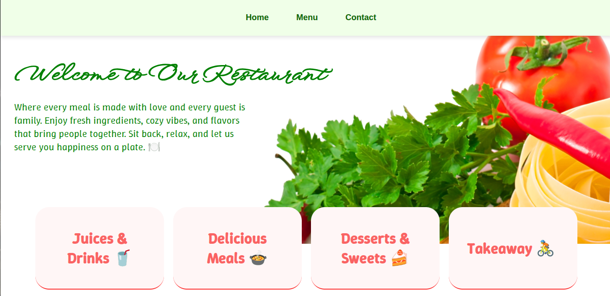

# 🍽️ Odin Restaurant Page

A simple restaurant homepage built as part of [The Odin Project](https://www.theodinproject.com/).  
This project uses **JavaScript**, **Webpack**, and **modular components** to dynamically render content on the page.

---

## 🚀 Live Demo
🔗 [View on GitHub Pages](https://priyanshi-singh022.github.io/odin-Restaurantpage/)

---

## ⚡ Features
- 🏠 **Home Page** – welcoming hero section  
- 🥗 **Menu Page** – displays food & beverages  
- 📞 **Contact Page** – contact info for the restaurant  
- 🔄 Single Page Application feel – pages switch dynamically with JS  
- ⚙️ Bundled with **Webpack**

---

## 🛠️ Installation & Setup

1. **Clone the repo**
   ```bash
   git clone https://github.com/priyanshi-singh022/odin-Restaurantpage.git
   cd odin-Restaurantpage
   ```
2. **Install dependencies**
```bash
  npm install
```
3. **Run in development mode**
```bash
  npm run start
  ```
4. **Runs webpack serve** – open http://localhost:8080/

## 📸 Preview


## 📚 What I Learned
  - Setting up Webpack for a modular JS project
  - Dynamically rendering content with JavaScript DOM manipulation
  - Organizing code with ES6 modules
  - Deploying with GitHub Pages

## 📌 Credits
  - Project idea from The Odin Project
  - Built with ❤️ by Priyanshi Singh
